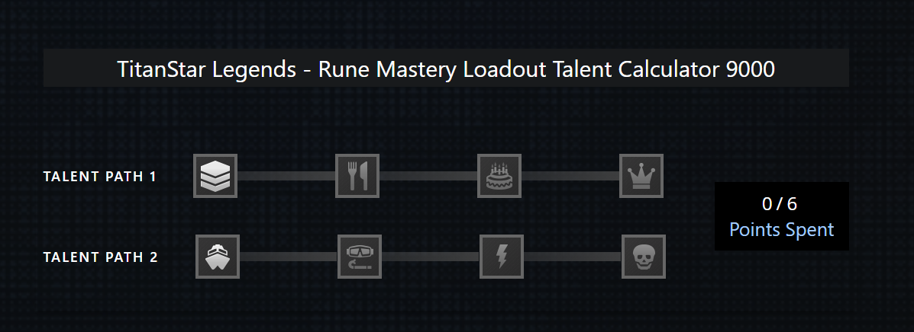

# TitanStar Legends - Rune Mastery Talent Calculator

## Project Overview
An interactive talent calculator for TitanStar Legends that allows users to allocate talent points across two different talent paths. This project demonstrates modern web development practices, accessibility features, and responsive design.

## Prerequisites
To run this project locally, you'll need to:

1. **Clone this repository onto your local machine**

2. **Install Node.js**: 
   - Ensure you have Node.js installed (version 14.0.0 or later recommended)

3. **Install `serve` Globally**:
   ```
   npm install -g serve
   ```
   The `serve` package allows you to quickly spin up a local development server to view the project index.html file and the associated JavaScript files.
   
   Navigate into the repository folder after you have cloned it and use the `serve` command in your terminal to launch a local development server (ie.localhost:3000).

5. ### Optional
   **Install SCSS compiler**:
   - I personally used the Live SASS Complier plugin on VSCode to compile my SCSS file.

## Screenshot



## Features

### Core Functionality
- Maximum of 6 talent points available
- Two distinct talent paths with 4 talents each
- Sequential talent selection (must select talents in order)
- Points tracking system
- Animated progress bars between connected talents

### User Interactions
- Left-click to add talent points
- Right-click to remove talent points
- Keyboard navigation support
- Error messages for invalid actions
- Visual feedback for selected and disabled states

### Accessibility
- Full keyboard navigation
- ARIA labels and roles
- Clear error messaging

### Responsive Design
- Mobile-first approach
- Breakpoints:
  - Mobile: < 868px
  - Tablet: 868px - 1023px
  - Desktop: ≥ 1024px
- Fluid typography and spacing

## Technical Implementation

### Architecture
The project follows the MVC (Model-View-Controller) pattern:
- **Model**: Manages talent point allocation and validation
- **View**: Handles DOM updates and user interactions
- **Controller**: Coordinates between Model and View

### Technologies Used
- HTML5
- SCSS/CSS3
- Vanilla JavaScript (ES6+)

### Key Components

#### Model (model.js)
- Manages the talent point state by tracking point allocation, validating point selections, and enforcing game rules while maintaining the preset point limits.

#### View (view.js)
- Handles DOM updates and user interactions, implementing comprehensive keyboard navigation, displaying error messages, and dynamically updating the visual states of the talent calculator.

#### Controller (controller.js)
- Coordinates between the Model and View, processing user actions, updating the application state, and managing the seamless data flow across the talent calculator's components.

## Accessibility Features
- Keyboard navigation using arrow keys
- ARIA labels for interactive elements
- Focus management
- Error announcements

## Future Improvements
- Unit testing implementation
- Build process setup
- Additional talent paths
- Talent build saving/sharing
- Tooltips for talents
- Enhanced animations
- Additional keyboard shortcuts

## Browser Support
- Chrome (latest)
- Firefox (latest)
- Safari (latest)
- Edge (latest)
